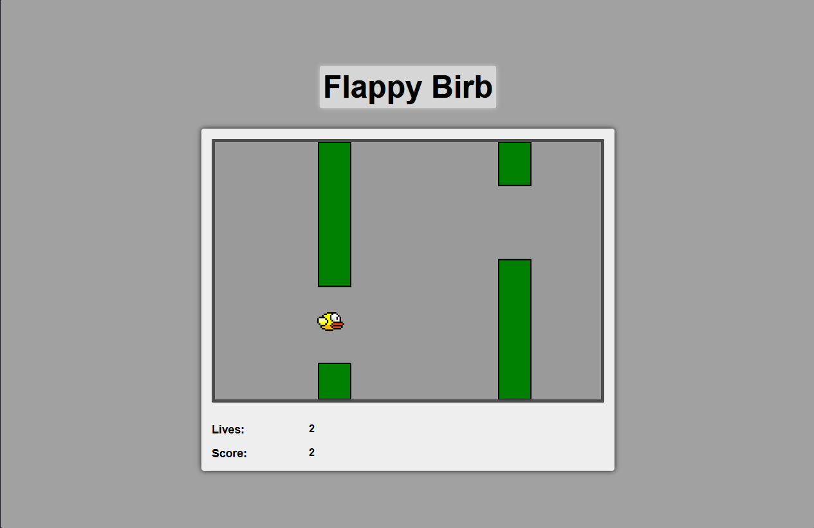
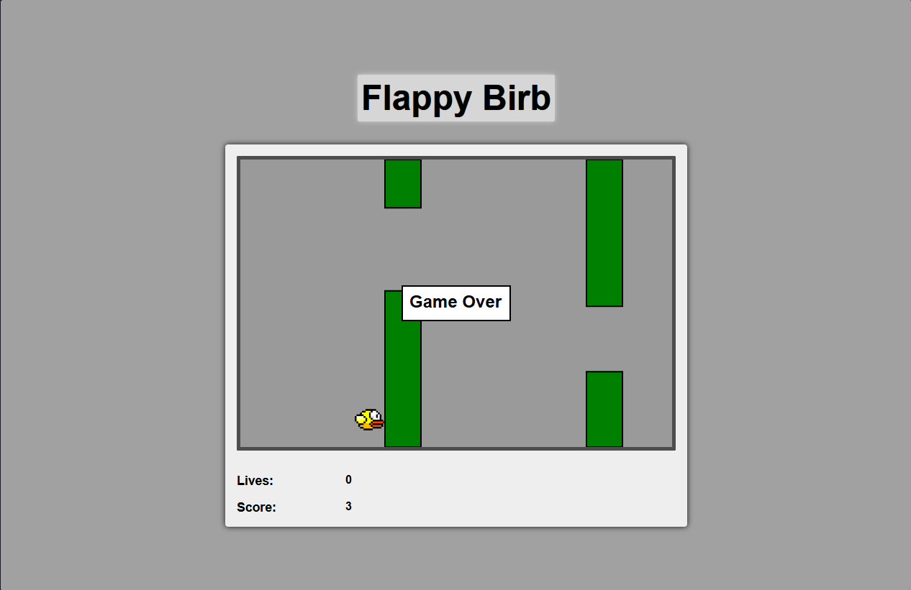

# Flappy Birb

A browser-based recreation of Flappy Bird developed using **TypeScript**, **RxJS**, **SVG**, and **Vite**.

This project was built to explore **Functional Reactive Programming (FRP)** by modelling game behaviour through observable streams and immutable state updates rather than traditional imperative game loops.

---

## Preview



---

## Features

- Functional Reactive Programming architecture
- Physics-based bird movement
- Procedurally generated pipe obstacles
- Collision detection
- Score tracking
- Multiple lives system
- Game Over state
- SVG rendering
- Unit tests with Vitest

---

## Technologies

- TypeScript
- RxJS
- SVG
- HTML
- CSS
- Vite
- Vitest

---

## Project Structure

```
src/
    main.ts         // Application entry point
    state.ts        // Immutable game state
    view.ts         // Rendering logic
    util.ts         // Helper functions
    types.ts        // Shared types
```

---

## Running the Project

Install dependencies

```bash
npm install
```

Run the development server

```bash
npm run dev
```

Run tests

```bash
npm test
```

---

## Gameplay

Control the bird using the **Spacebar** to fly through incoming pipe obstacles.

The objective is to survive for as long as possible while increasing your score. The game includes a multiple-life system before reaching a Game Over state.

---

## What I Learned

Through this project I gained experience with:

- Functional Reactive Programming
- Managing application state with immutable updates
- Event-driven programming using observables
- Collision detection
- Browser game development using SVG
- Structuring medium-sized TypeScript applications

---

## Acknowledgements

Developed as part of **FIT2102 – Programming Paradigms** at Monash University Malaysia.